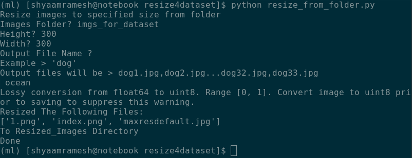

# resize4dataset
Automatically resize files from a folder for a machine learning dataset   
This script requires <code>skimage</code> to be installed 
Install via pip > <code>pip install scikit-image</code> 
Install via anaconda > <code>conda install -c conda-forge scikit-image</code>  

  
<b>TIP: </b> Batch download all images from a google image search using these extensions, then use <u>resize4dataset</u> t prepare these images for training. 
<a href="https://addons.mozilla.org/en-US/firefox/addon/save-all-images-webextension/">Save All Images - Firefox</a>  
<a href="https://chrome.google.com/webstore/detail/fatkun-batch-download-ima/nnjjahlikiabnchcpehcpkdeckfgnohf">Fatkun Batch Image Downloader - Chrome</a>
